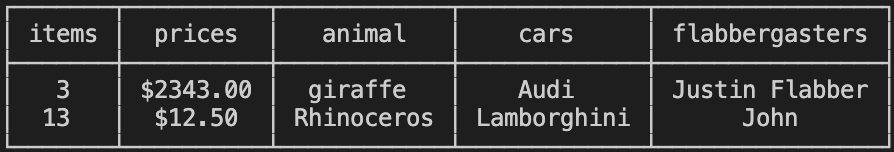
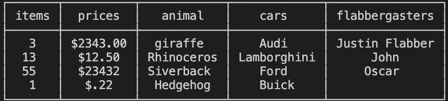
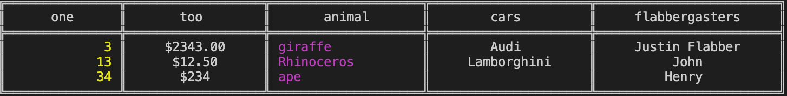

# CLI Table output for objects and arrays

Why? The existing console.table output is actually really great, but it could use some more formatting options.

## Install from npm

`npm i tablecli`

## <u>Usage</u>

<b>Create a new table</b>  
<pre>
    const { TableCli } = require('tablecli');

    const mockArray = [
	  ['items', 'prices', 'animal', 'cars', 'flabbergasters'],
	  [3, '$2343.00', 'giraffe', 'Audi', 'Justin Flabber'],
	  [13, '$12.50', 'Rhinoceros', 'Lamborghini', 'John']
    ];

    const table = new TableCli();
    table.setData(mockArray);

    table.showTable();
];
</pre>
 

<b>Create a new table and add rows</b>  
<pre>
    const { TableCli } = require('tablecli');

    const mockObject = {
	  items: [3, 13, 34],
	  prices: ['$2343.00', '$12.50', '$234'],
	  animal: ['giraffe', 'Rhinoceros', 'ape'],
	  cars: ['Audi', 'Lamborghini'],
	  flabbergasters: ['Justin Flabber', 'John', 'Henry'] 
    }

    const table = new TableCli();
    table.setData(mockObject);

    Table.addRow([55, '$23432', 'Siverback', 'Ford', 'Oscar',
      'too many!']);
    Table.addRow([1, '$.22', 'Hedgehog', 'Buick']);

    table.showTable();
];
</pre>

<b>Customize headers, columns</b>
<pre>
    const mockObject = {
	  items: [3, 13, 34],
	  prices: ['$2343.00', '$12.50', '$234'],
	  animal: ['giraffe', 'Rhinoceros', 'ape'],
	  cars: ['Audi', 'Lamborghini'],
	  flabbergasters: ['Justin Flabber', 'John', 'Henry'] 
    }

    const options = {
	  align: 'center',
      padding: 10,
      borderType: 'double',
      headers: ['one', 'too'],
	  columnInformation: [
          { color: 'yellow', align: 'right'},
          {},
          {color: 'magenta', align: 'left'}
        ]
    }
    const table = new TableCli(options);
    table.setData(mockObject);
    table.showTable();
</pre>

